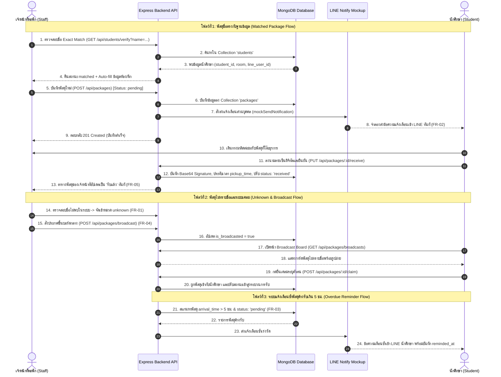
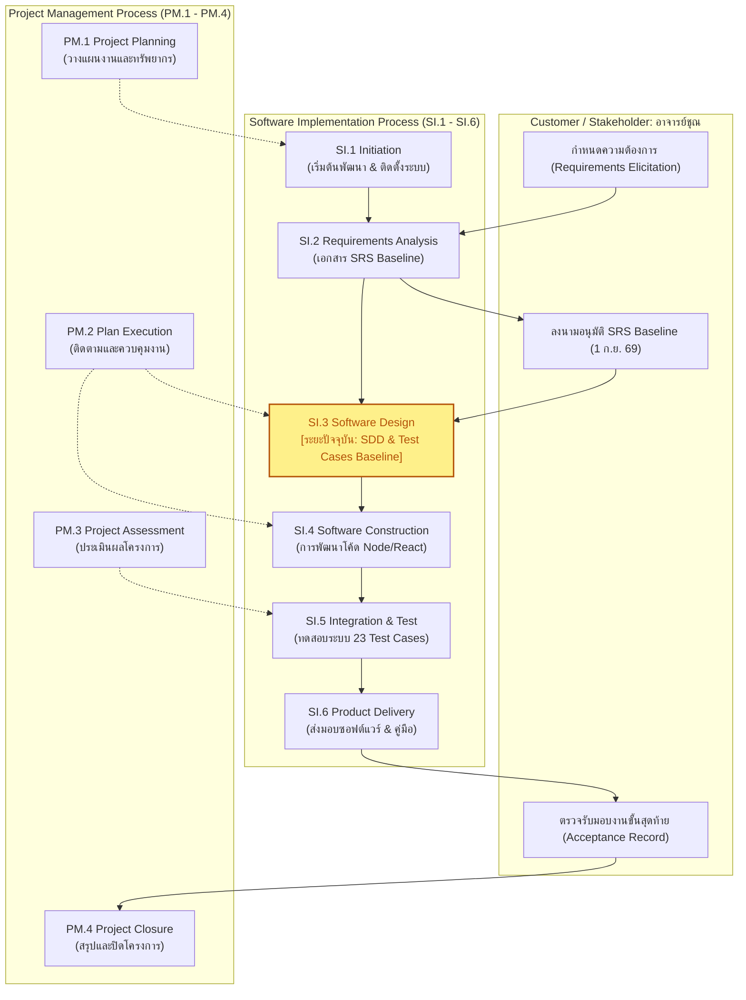

# เอกสารการออกแบบซอฟต์แวร์ (Software Design Document: SDD)
## โครงการ: ระบบติดตามและแจ้งเตือนพัสดุหอพัก (RMUTL Smart Dormitory Package Notification & Tracking System)

---

### ข้อมูลเอกสารและการอนุมัติแบบสถาปัตยกรรม (Document Control & Architecture Baseline)

| หัวข้อ | รายละเอียด |
| :--- | :--- |
| **รหัสเอกสาร** | `DOC-SDD-ENGSE205-03` |
| **ชื่อระบบ** | ระบบติดตามและแจ้งเตือนพัสดุหอพัก (Smart Dormitory Package Notification & Tracking System) |
| **เวอร์ชันเอกสาร** | `2.0.0 (Approved Software Design Baseline)` |
| **สถานะเอกสาร** | **ผ่านการทบทวนและอนุมัติแบบสถาปัตยกรรม (Approved Software Design Baseline) พร้อมส่งมอบสู่ SI.4 (Construction) และ SI.5 (Testing)** |
| **ผู้ให้ความต้องการ / ลูกค้า** | **นางสาวชุณหะกาญจน์ พันธุ์เจริญ (อาจารย์ชุณ)** — ที่ปรึกษาโครงการและตัวแทนผู้ว่าจ้าง |
| **วันที่อนุมัติแบบสถาปัตยกรรม** | **17 กันยายน 2569** (ช่วงสิ้นสุดระยะออกแบบ SI.3 / Sprint 3) |
| **มาตรฐานอ้างอิง** | ISO/IEC 29110 (Basic Profile - SI.3 Software Design), IEEE Std 1016-2009 (Software Design Descriptions) |
| **รายวิชา** | ENGSE205 Software Process and Quality Assurance |
| **สถาบัน** | มหาวิทยาลัยเทคโนโลยีราชมงคลล้านนา (RMUTL) |
| **ทีมสถาปนิกและผู้พัฒนา (76 Company)** | 1. ณัฏฐกิตติ์ รอดเรือน (Project Lead & System Architect)<br>2. ธนโชติ จาติระดุก (Staff Subsystem Lead)<br>3. มงคล อาษากิจ (Backend & Service Lead)<br>4. วชิรวิชญ์ ปินะกาโร (Student Subsystem Lead) |

#### บันทึกการแก้ไข (Revision History)
| เวอร์ชัน | วันที่ | ผู้ปรับปรุง | รายละเอียดการปรับปรุง |
| :---: | :---: | :--- | :--- |
| 0.1.0 | 3 ก.ย. 2569 | ทีม 76 Company | ร่างแบบสถาปัตยกรรมระบบเบื้องต้น (High-Level Architecture Draft) |
| 1.0.0 | 10 ก.ย. 2569 | ทีม 76 Company | ออกแบบ Database Schema, REST Endpoints, และโครงสร้างโมดูลย่อย |
| 2.0.0 | 17 ก.ย. 2569 | ทีม 76 Company | ปรับปรุงสถาปัตยกรรมระบบสมบูรณ์ เพิ่ม BPMN Swimlane, RTM, และ Baseline SI.3 |

---

## สารบัญ (Table of Contents)
1. [บทที่ 1: บทนำ ขอบเขต และเป้าหมายการออกแบบ (Introduction & Scope)](#บทที่-1-บทนำ-ขอบเขต-และเป้าหมายการออกแบบ-introduction--scope)
2. [บทที่ 2: สถาปัตยกรรมระบบและโครงสร้างเลเยอร์ (System Architecture)](#บทที่-2-สถาปัตยกรรมระบบและโครงสร้างเลเยอร์-system-architecture)
3. [บทที่ 3: แผนภาพกระบวนการทำงาน BPMN (Business Process Model & Notation)](#บทที่-3-แผนภาพกระบวนการทำงาน-bpmn-business-process-model--notation)
4. [บทที่ 4: การออกแบบระบบย่อยและคอมโพเนนต์ (Subsystem & Component Detailed Design)](#บทที่-4-การออกแบบระบบย่อยและคอมโพเนนต์-subsystem--component-detailed-design)
5. [บทที่ 5: โครงสร้างฐานข้อมูลและพจนานุกรมข้อมูล (Database Schema Design & Data Dictionary)](#บทที่-5-โครงสร้างฐานข้อมูลและพจนานุกรมข้อมูล-database-schema-design--data-dictionary)
6. [บทที่ 6: สถาปัตยกรรมส่วนต่อประสานและสัญญา API (Interface & API Contracts)](#บทที่-6-สถาปัตยกรรมส่วนต่อประสานและสัญญา-api-interface--api-contracts)
7. [บทที่ 7: สถาปัตยกรรมการจัดการข้อผิดพลาดและบันทึกระบบ (Error Handling & Logging Architecture)](#บทที่-7-สถาปัตยกรรมการจัดการข้อผิดพลาดและบันทึกระบบ-error-handling--logging-architecture)
8. [บทที่ 8: สถาปัตยกรรมความปลอดภัยและคุณลักษณะเชิงคุณภาพ (Security & Non-Functional Architecture)](#บทที่-8-สถาปัตยกรรมความปลอดภัยและคุณลักษณะเชิงคุณภาพ-security--non-functional-architecture)
9. [บทที่ 9: เมทริกซ์การตรวจสอบย้อนกลับการออกแบบ (Design Traceability Matrix: D-RTM)](#บทที่-9-เมทริกซ์การตรวจสอบย้อนกลับการออกแบบ-design-traceability-matrix-d-rtm)
10. [บทที่ 10: การลงนามอนุมัติแบบสถาปัตยกรรม (Software Design Baseline Sign-Off)](#บทที่-10-การลงนามอนุมัติแบบสถาปัตยกรรม-software-design-baseline-sign-off)

---

## บทที่ 1: บทนำ ขอบเขต และเป้าหมายการออกแบบ (Introduction & Scope)

### 1.1 วัตถุประสงค์ของเอกสาร (Purpose & ISO/IEC 29110 SI.3 Context)
เอกสารการออกแบบซอฟต์แวร์ (Software Design Document: SDD) ฉบับนี้ จัดทำขึ้นภายใต้กระบวนการวิศวกรรมซอฟต์แวร์ **ISO/IEC 29110 (Software Implementation Process: SI.3 Software Architectural and Detailed Design)** และมาตรฐาน **IEEE Std 1016-2009** เพื่อทำหน้าที่แปลงข้อกำหนดความต้องการที่ผ่านการอนุมัติ (Approved Requirements Baseline: `SRS-ENGSE205-2026-V1.0`) จากระยะ SI.2 ให้กลายเป็นพิมพ์เขียวทางสถาปัตยกรรม (Architectural Blueprints), แผนผังกระบวนการทำงานเชิงธุรกิจ (BPMN Diagrams), โครงสร้างฐานข้อมูล (Data Models & Schemas), ข้อกำหนดการเชื่อมต่อส่วนต่อประสาน (Interface & API Contracts), และเมทริกซ์การตรวจสอบย้อนกลับ (Requirements Traceability Matrix: RTM) เพื่อเป็นแนวทางที่ชัดเจนและรัดกุมสำหรับทีมผู้พัฒนาในการเขียนโปรแกรม (SI.4 Construction) และการทดสอบระบบ (SI.5 Integration and Testing)

### 1.2 ขอบเขตของระบบ (System Scope)
การออกแบบสถาปัตยกรรมครอบคลุมฟังก์ชันการทำงานหลัก 5 ประการตาม Functional Requirements (FR-01 ถึง FR-05) และ Non-Functional Requirements (NFR-01, NFR-02):
* **REQ-FR01 (การบันทึกและตรวจสอบชื่อ):** ออกแบบกลไกตรวจสอบชื่อ Exact Match Verification ผ่าน REST API `/api/students/verify` พร้อม Auto-fill ข้อมูลห้องพัก อาคาร และ LINE ID อัตโนมัติ
* **REQ-FR02 (ระบบจำลองการแจ้งเตือนส่วนบุคคล):** ออกแบบบริการ Notification Service ผสานการทำงานกับ `mock-line-notify.js` ส่งแจ้งเตือนจำลองตรงไปยัง LINE ของนักศึกษาทันทีในระดับมิลลิวินาที
* **REQ-FR03 (การแจ้งเตือนซ้ำพัสดุค้างรับเกิน 5 ชั่วโมง):** ออกแบบกลไก Background / Scheduled Scanner ผ่าน `/api/notifications/check-reminders` ตรวจหาพัสดุสถานะ pending ที่ค้างรับเกิน 5 ชม.
* **REQ-FR04 (กระดานประกาศพัสดุไม่ทราบชื่อและระบบยื่นเคลม):** ออกแบบระบบ Broadcast Board และ Workflow การยื่นขอเคลมพัสดุ (`POST /claim`) สำหรับนักศึกษา
* **REQ-FR05 (การลงนามและเซ็นรับพัสดุดิจิทัล):** ออกแบบผืนผ้าใบ Canvas สำหรับลงลายมือชื่อบนหน้าจอนักศึกษา แปลงเป็น Base64 Data URL บันทึกพร้อมประทับเวลาจริง `pickup_time`
* **REQ-NFR (คุณภาพและประสิทธิภาพ):** ออกแบบสถาปัตยกรรมให้ API มี Latency เฉลี่ยต่ำกว่า 200 ms, มี Centralized Error Handling, และจัดเก็บข้อมูลอย่างคงทนบน MongoDB

---

## บทที่ 2: สถาปัตยกรรมระบบและโครงสร้างเลเยอร์ (System Architecture)

ระบบใช้สถาปัตยกรรมแบบ **Multi-tier Client-Server with Layered Service Architecture** โดยแบ่งออกเป็น 3 ระดับชั้น (Tiers) หลัก:

```
+-------------------------------------------------------------------------------+
|                                CLIENT TIER                                    |
|  +-----------------------------------+     +-------------------------------+  |
|  |     Staff Portal (React + Vite)   |     |  Student Portal (React + Vite)|  |
|  |       Port: 5174                  |     |    Port: 5173 (Responsive)    |  |
|  |  [Dashboard, PackageForm, Modals] |     | [BroadcastBoard, Signature]   |  |
|  +-----------------+-----------------+     +---------------+---------------+  |
|                    |                                       |                  |
|                    v                                       v                  |
|  +-------------------------------------------------------------------------+  |
|  |             Frontend API Client Layer (Unified apiClient.js)            |  |
|  |         - BaseURL via import.meta.env.VITE_API_BASE_URL (Default: 5000) |  |
|  |         - Centralized HTTP Methods & Standard Error Normalization       |  |
|  +-------------------------------------+-----------------------------------+  |
+----------------------------------------|--------------------------------------+
                                         | HTTP / JSON REST
                                         v
+-------------------------------------------------------------------------------+
|                               SERVER TIER                                     |
|  +-------------------------------------------------------------------------+  |
|  |                       Node.js + Express Server (Port: 5000)             |  |
|  |  - Central Config: src/config/config.js (PORT, MONGO_URI, CORS_ORIGIN)  |  |
|  |  - HTTP Request Logger: Morgan middleware                               |  |
|  |  - Security & Parsing: cors(whitelist), express.json(limit: 10mb)       |  |
|  +-------------------------------------+-----------------------------------+  |
|                                        |                                      |
|  +-------------------------------------+-----------------------------------+  |
|  |                         Express Routes & Middlewares                    |  |
|  |  - /api/packages         -> packageController.js (CRUD, Broadcast)      |  |
|  |  - /api/students         -> studentController.js (Exact Match Verify)   |  |
|  |  - /api/notifications    -> notificationService.js (Mock LINE Notify)   |  |
|  |  - Central Error Handler -> errorHandler.js (AppError, notFoundHandler) |  |
|  +-------------------------------------+-----------------------------------+  |
|                                        |                                      |
|  +-------------------------------------+-----------------------------------+  |
|  |                       Service & Business Logic Layer                    |  |
|  |  - Notification Service: mockSendNotification integration               |  |
|  |  - Signature & Claim Processor: Status transition & persistence         |  |
|  +-------------------------------------+-----------------------------------+  |
+----------------------------------------|--------------------------------------+
                                         | Mongoose ODM
                                         v
+-------------------------------------------------------------------------------+
|                               DATABASE TIER                                   |
|  MongoDB (port: 27017)                                                        |
|  - Collection: students      (Mock student profiles & LINE user IDs)          |
|  - Collection: packages      (Package lifecycle, status, signature, image)    |
|  - Collection: notifications (History of sent LINE notifications)             |
+-------------------------------------------------------------------------------+
```

---

## บทที่ 3: แผนภาพกระบวนการทำงาน BPMN (Business Process Model & Notation)

### 3.1 แผนภาพ BPMN กระบวนการทำงานทางธุรกิจ (Business Process Swimlane Diagram)




#### ตารางรายละเอียดขั้นตอนการทำงานตาม Swimlane (BPMN Detailed Activities)
| ขั้นตอน | บทบาท (Lane) | กิจกรรม / เหตุการณ์ (Task/Event) | ข้อมูลเข้า/ออก (I/O) | ข้อกำหนด |
| :---: | :--- | :--- | :--- | :---: |
| **Step 1** | Staff (เจ้าหน้าที่) | พัสดุมาถึง -> กรอกชื่อผู้รับและเลขพัสดุลงในแบบฟอร์ม | ชื่อ, เลขพัสดุ, รูปถ่าย | `FR-01` |
| **Step 2** | Backend & DB | ตรวจสอบชื่อ Exact Match เทียบกับคอลเลกชัน students | Query: receiver_name -> Matched Student | `FR-01` |
| **Step 3A** | Backend & Staff | [กรณีพบชื่อ] Auto-fill ข้อมูลห้อง/LINE -> บันทึกสถานะ pending | Status: 'pending', matched_student: ID | `FR-01` |
| **Step 3B** | Backend & Staff | [กรณีไม่พบชื่อ] จัดเข้าหมวด unknown -> สั่ง Broadcast ขึ้นบอร์ดกลาง | Status: 'unknown', is_broadcasted: true | `FR-01, FR-04` |
| **Step 4** | Notification Service | ส่ง Mock LINE Notify แจ้งเตือนไปยัง LINE ของนักศึกษาทันที | Payload: ชื่อ, ห้อง, เลขพัสดุ, เวลา | `FR-02` |
| **Step 5** | Student (นักศึกษา) | ตรวจสอบบอร์ด/รับแจ้งเตือน -> ยื่นเคลม (ถ้าเป็น unknown) -> มารับของ | Student ID, Claim Form | `FR-04, FR-05` |
| **Step 6** | Student & Backend | ลงนามลายมือชื่อดิจิทัลผ่าน Canvas และส่งยืนยันการรับ | Base64 Signature -> status: 'received' | `FR-05` |

---

### 3.2 แผนภาพวงจรชีวิตกระบวนการตามมาตรฐาน ISO/IEC 29110 (VSE Process Lifecycle)




---

## บทที่ 4: การออกแบบระบบย่อยและคอมโพเนนต์ (Subsystem & Component Detailed Design)

### 4.1 Staff Portal Subsystem (`frontend/staff` - Port 5174)
* **`App.jsx`:** คอมโพเนนต์หลักทำหน้าที่เป็น State Store สำหรับข้อมูลพัสดุ (packages), รายชื่อนักศึกษา (students), และการกรองข้อมูลตามหมวดหมู่
* **`PackageForm.jsx`:** แบบฟอร์มสำหรับเจ้าหน้าที่ป้อนข้อมูลพัสดุ เชื่อมต่อกับ `/api/students/verify` เพื่อตรวจสอบชื่อ Exact Match แบบ Real-time ทันทีที่พิมพ์ชื่อครบ
* **`PackageManagement.jsx`:** ตารางแสดงรายการพัสดุพร้อมตัวกรองสถานะ (All, Pending, Received, Unknown) และปุ่มปรับเปลี่ยนสถานะ
* **`UnknownPackages.jsx`:** รายการพัสดุไม่ทราบชื่อ พร้อมปุ่ม Broadcast เพื่อสั่งกระจายพัสดุขึ้นบอร์ดกลาง
* **`StatCard.jsx`:** สรุปตัวเลขสถิติภาพรวมพัสดุทั้งหมด, รอมารับ, รับแล้ว, และไม่ทราบชื่อ
* **`ConfirmDeleteModal.jsx`:** กล่องข้อความยืนยันความปลอดภัยก่อนทำการลบข้อมูลพัสดุออกจากระบบ

### 4.2 Student Portal Subsystem (`frontend/student` - Port 5173)
* **`App.jsx`:** จัดการการค้นหาพัสดุของตนเองผ่านชื่อ-นามสกุล หรือรหัสนักศึกษา ออกแบบรองรับการใช้งานบนสมาร์ตโฟน (Mobile-Responsive)
* **`BroadcastBoard.jsx`:** กระดานแสดงพัสดุไม่ทราบชื่อที่ถูก Broadcast มาจากเจ้าหน้าที่ มีระบบยื่นขอเคลม (Claim Package)
* **`SignatureCanvas`:** ผืนผ้าใบแบบ HTML5 Canvas ให้นักศึกษาใช้นิ้วหรือปากกาวาดลายมือชื่อดิจิทัล และแปลงเป็น Base64 Data URL เพื่อส่งยืนยันการรับพัสดุ

### 4.3 Backend API Subsystem (`backend/src` - Port 5000)
* **`packageController.js`:** จัดการ CRUD พัสดุ, การเปลี่ยนสถานะ, การสั่ง Broadcast, การเคลม, และการยืนยันการรับพร้อมลายเซ็น
* **`studentController.js`:** ควบคุมการตรวจสอบชื่อ Exact Match และการดึงข้อมูลทะเบียนนักศึกษา
* **`notificationService.js`:** รับคำสั่งส่งแจ้งเตือนและผสานการทำงานกับโมดูลจำลองภายนอก
* **`errorHandler.js`:** จัดการข้อผิดพลาดส่วนกลาง คืนผลลัพธ์เป็นมาตรฐาน JSON พร้อมแปลง Status Code

### 4.4 Notification Mockup Service (`notify-mockup` Subsystem)
* จำลองการทำงานของ LINE Notify (`mock-line-notify.js`)
* จำลองการส่ง HTTP POST ไปยัง LINE Notify API Gateway
* แสดงผลลัพธ์การส่งผ่าน Server Console พร้อมบันทึก Timestamp และสถานะการส่ง (Success Rate: 100%)

---

## บทที่ 5: โครงสร้างฐานข้อมูลและพจนานุกรมข้อมูล (Database Schema Design & Data Dictionary)

### 5.1 คอลเลกชัน: `students` (ทะเบียนข้อมูลนักศึกษาหอพัก)
| ฟิลด์ (Field) | ชนิดข้อมูล (Type) | ข้อกำหนด (Constraints) | คำอธิบาย |
| :--- | :--- | :--- | :--- |
| `_id` | ObjectId | Auto-generated PK | รหัสระเบียนเอกสารเฉพาะใน MongoDB |
| `student_id` | String | Required, Unique, Trimmed | รหัสนักศึกษา (เช่น "651234567-8") |
| `first_name` | String | Required, Trimmed | ชื่อจริงภาษาไทยของนักศึกษา |
| `last_name` | String | Required, Trimmed | นามสกุลภาษาไทยของนักศึกษา |
| `building` | String | Required | อาคารหอพัก (เช่น "หอพักชาย 1", "S20") |
| `room_number` | String | Required | หมายเลขห้องพัก (เช่น "202", "314") |
| `line_user_id` | String | Optional (Indexed) | LINE User ID หรือ LINE Account Handle |
| `phone_number` | String | Optional | เบอร์โทรศัพท์ติดต่อ |

### 5.2 คอลเลกชัน: `packages` (ข้อมูลพัสดุและวงจรสถานะ)
| ฟิลด์ (Field) | ชนิดข้อมูล (Type) | ข้อกำหนด (Constraints) | คำอธิบาย |
| :--- | :--- | :--- | :--- |
| `_id` | ObjectId | Auto-generated PK | รหัสระเบียนพัสดุเฉพาะใน MongoDB |
| `tracking_number`| String | Required, Indexed | เลขพัสดุบนกล่อง (Tracking Number) |
| `receiver_name_on_box`| String | Required, Trimmed | ชื่อผู้รับที่จ่าหน้าบนกล่องพัสดุ |
| `matched_student`| ObjectId | Ref: 'Student', Nullable | การเชื่อมโยง Foreign Key ไปยัง Student |
| `status` | String | Enum: `['pending', 'received', 'unknown']` | สถานะพัสดุ (Default: 'pending') |
| `is_broadcasted` | Boolean | Default: false | สถานะการประกาศขึ้นบอร์ดกลาง (FR-04) |
| `image_path` | String | Optional (Base64/URL) | รูปถ่ายกล่องพัสดุสำหรับช่วยระบุตัวตน |
| `arrival_time` | Date | Default: Date.now | วันและเวลาที่พัสดุถูกบันทึกเข้าระบบ |
| `pickup_time` | Date | Default: null | วันและเวลาที่นักศึกษามารับพัสดุจริง |
| `signature_data` | String | Long String (Base64 Data URL) | ข้อมูลภาพลายเซ็นดิจิทัลของนักศึกษา (FR-05) |
| `reminded_at` | Date | Default: null | วันเวลาล่าสุดที่มีการส่งแจ้งเตือนซ้ำ (FR-03) |

### 5.3 คอลเลกชัน: `notifications` (ประวัติการส่งแจ้งเตือน)
| ฟิลด์ (Field) | ชนิดข้อมูล (Type) | ข้อกำหนด (Constraints) | คำอธิบาย |
| :--- | :--- | :--- | :--- |
| `_id` | ObjectId | Auto-generated PK | รหัสระเบียนประวัติการแจ้งเตือน |
| `recipient` | String | Required | ผู้รับการแจ้งเตือน (ชื่อนักศึกษา หรือ LINE ID) |
| `package_id` | ObjectId | Ref: 'Package', Required | รหัสพัสดุที่เกี่ยวข้องกับการแจ้งเตือน |
| `type` | String | Enum: `['arrival', 'reminder_5h', 'broadcast']` | ประเภทการแจ้งเตือน |
| `message` | String | Required | ข้อความแจ้งเตือนฉบับสมบูรณ์ที่ถูกจัดรูปแบบ |
| `sent_at` | Date | Default: Date.now | วันเวลาที่ระบบทำการส่งข้อความสำเร็จ |

---

## บทที่ 6: สถาปัตยกรรมส่วนต่อประสานและสัญญา API (Interface & API Contracts)

ระบบสื่อสารระหว่าง Client Tier และ Server Tier ผ่าน RESTful JSON API รวมทั้งสิ้น 16 Endpoints ตามที่ระบุไว้ใน `API_CONTRACT.md`:

| หมวดหมู่ | Method | Endpoint URI | คำอธิบาย / รหัสความต้องการ |
| :--- | :---: | :--- | :--- |
| **System** | `GET` | `/` | Health Check ตรวจสอบสถานะเซิร์ฟเวอร์ |
| **Verification** | `GET` | `/api/students/verify` | ตรวจสอบชื่อ Exact Match & Auto-fill (`FR-01`) |
| **Students** | `GET` | `/api/students` | ดึงรายชื่อนักศึกษาทั้งหมดในระบบ |
| | `POST`| `/api/students` | เพิ่มข้อมูลนักศึกษาใหม่เข้าระบบ |
| **Packages** | `GET` | `/api/packages` | ดึงรายการพัสดุทั้งหมด (รองรับ status filter) |
| | `POST`| `/api/packages` | บันทึกพัสดุใหม่ พร้อมส่ง LINE Notify (`FR-01`, `FR-02`) |
| | `GET` | `/api/packages/:id` | ดึงข้อมูลพัสดุรายชิ้นตาม Object ID |
| | `PUT` | `/api/packages/:id` | แก้ไขข้อมูลพัสดุ (Tracking, Receiver, Status) |
| | `DELETE`| `/api/packages/:id` | ลบข้อมูลพัสดุออกจากฐานข้อมูล |
| | `PUT` | `/api/packages/:id/status` | เปลี่ยนสถานะพัสดุ (`pending`, `received`, `unknown`) |
| | `PUT` | `/api/packages/:id/receive`| ยืนยันการรับพัสดุพร้อมบันทึก Digital Signature (`FR-05`) |
| **Broadcast** | `POST`| `/api/packages/broadcast` | สั่งประกาศพัสดุไม่ทราบชื่อขึ้นบอร์ดกลาง (`FR-04`) |
| | `GET` | `/api/packages/broadcasts`| ดึงรายการพัสดุที่กำลังประกาศบนบอร์ดกลาง (`FR-04`) |
| | `POST`| `/api/packages/:id/claim` | นักศึกษายื่นขอเคลมพัสดุว่าเป็นของตนเอง (`FR-04`) |
| **Notification** | `GET` | `/api/notifications/check-reminders` | สแกนพัสดุค้างรับเกิน 5 ชม. และส่งเตือนซ้ำ (`FR-03`) |
| **Maintenance** | `POST`| `/api/packages/reset-database` | รีเซ็ตฐานข้อมูลเป็นค่าเริ่มต้นสำหรับการทดสอบ |

---

## บทที่ 7: สถาปัตยกรรมการจัดการข้อผิดพลาดและบันทึกระบบ (Error Handling & Logging Architecture)

### 7.1 โครงสร้างการดักจับข้อผิดพลาด (Centralized Error Pipeline)
ทุก Controller จะถูกห่อหุ้มด้วย `asyncHandler` เพื่อดักจับ Async Rejection อัตโนมัติ และเมื่อเกิด Business Logic Error จะทำการโยน `AppError(message, statusCode)` ส่งต่อไปยัง `errorHandler` ซึ่งเป็น Middleware ตัวสุดท้ายของ Express:

```json
{
  "success": false,
  "status": "fail",
  "message": "ไม่พบพัสดุที่ระบุในระบบ",
  "statusCode": 404
}
```

### 7.2 การบันทึกการทำงานของระบบ (HTTP Request Logging with Morgan)
ระบบติดตั้ง Morgan Logger ที่ `backend/src/app.js` ในรูปแบบ `:method :url :status :response-time ms - :res[content-length]` เพื่อบันทึกทุกคำขอที่เข้ามายัง API เซิร์ฟเวอร์แบบเรียลไทม์ สนับสนุนการตรวจสอบย้อนกลับ (Audit Trail) และการวิเคราะห์ปัญหาในกระบวนการทดสอบ

---

## บทที่ 8: สถาปัตยกรรมความปลอดภัยและคุณลักษณะเชิงคุณภาพ (Security & Non-Functional Architecture)

* **CORS Whitelist Protection:** กำหนด Whitelist เฉพาะ Client Origin ที่ได้รับอนุญาต (`http://localhost:5173`, `http://localhost:5174`, `http://localhost:3000`) เพื่อป้องกันการโจมตีแบบ Cross-Origin Unauthorized Access
* **Payload Size Limit (10MB):** กำหนดข้อจำกัดขนาดของ Request Body สูงสุดที่ 10 MB (`express.json({ limit: '10mb' })`) เพื่อรองรับการส่งภาพถ่ายพัสดุและภาพลายมือชื่อดิจิทัล Base64 Data URL โดยป้องกันปัญหา Denial of Service จาก Payload ขนาดใหญ่เกินควร
* **Data Persistence & Integrity:** มีกลไก Mongoose Schema Validation ตรวจสอบความถูกต้องของข้อมูลก่อนบันทึกลงใน MongoDB และจัดการ Connection Pool อย่างมีประสิทธิภาพ
* **Responsive & Mobile UX Design:** Student Portal ถูกออกแบบด้วย Mobile-First Layout เพื่อให้นักศึกษาสามารถเปิดผ่านสมาร์ตโฟนเพื่อลงลายมือชื่อดิจิทัลผ่านผืนผ้าใบสัมผัสได้อย่างลื่นไหล

---

## บทที่ 9: เมทริกซ์การตรวจสอบย้อนกลับการออกแบบ (Design Traceability Matrix: D-RTM)

ตามมาตรฐาน ISO/IEC 29110 (SI.3) เอกสารการออกแบบต้องแสดงความเชื่อมโยงย้อนกลับ (Traceability) ครบ 100% ระหว่าง ข้อกำหนดความต้องการ (SRS) -> คอมโพเนนต์สถาปัตยกรรม -> โครงสร้างข้อมูล -> API Endpoint -> ชุดการทดสอบ (Test Cases):

| รหัสข้อกำหนด (SRS) | คอมโพเนนต์การออกแบบ | คอลเลกชันฐานข้อมูล | API Endpoints | ชุดการทดสอบ (Test Cases) |
| :---: | :--- | :--- | :--- | :---: |
| **REQ-FR01** | `PackageForm`, `studentController` | `students`, `packages` | `/api/students/verify`, `/api/packages` | `TC-FR01-01` ถึง `05` |
| **REQ-FR02** | `notificationService`, `mock-line` | `notifications` | `POST /api/packages` | `TC-FR02-01` ถึง `03` |
| **REQ-FR03** | `notificationService`, Background Scanner | `packages`, `notifications` | `GET /api/notifications/check-reminders` | `TC-FR03-01` ถึง `03` |
| **REQ-FR04** | `UnknownPackages`, `BroadcastBoard` | `packages` | `/api/packages/broadcast`, `/claim` | `TC-FR04-01` ถึง `04` |
| **REQ-FR05** | `SignatureCanvas`, `packageController` | `packages` (`signature_data`) | `PUT /api/packages/:id/receive` | `TC-FR05-01` ถึง `04` |
| **REQ-NFR01** | Central Express API, Morgan | ทุกคอลเลกชัน | ทุก Endpoints (Latency < 200ms) | `TC-NFR-01` |
| **REQ-NFR02** | MongoDB, Mongoose ODM | `students`, `packages`, `notifs` | Data Persistence across restarts | `TC-NFR-02` |

---

## บทที่ 10: การลงนามอนุมัติแบบสถาปัตยกรรม (Software Design Baseline Sign-Off)

ตามกระบวนการ **ISO/IEC 29110 (SI.3.5 Establish Baseline)** สถาปัตยกรรมและรายละเอียดการออกแบบทั้งหมดในเอกสารฉบับนี้ ได้รับการพิจารณาทบทวนและลงนามอนุมัติร่วมกันโดยทีมสถาปนิกและผู้พัฒนาซอฟต์แวร์ เพื่อใช้เป็นพิมพ์เขียวหลักในการเขียนโปรแกรม (SI.4) และการทดสอบระบบ (SI.5):

| ลำดับ | ชื่อ-นามสกุล ผู้รับผิดชอบ | บทบาทหน้าที่ในการออกแบบ | ลายมือชื่อ / วันที่ |
| :---: | :--- | :--- | :---: |
| 1 | นายณัฏฐกิตติ์ รอดเรือน | Project Lead & System Architect (ผู้ออกแบบสถาปัตยกรรมรวมและ BPMN) | ณัฏฐกิตติ์ รอดเรือน<br>(17 ก.ย. 2569) |
| 2 | นายธนโชติ จาติระดุก | Staff Subsystem Lead (ผู้ออกแบบส่วนพอร์ทัลเจ้าหน้าที่) | ธนโชติ จาติระดุก<br>(17 ก.ย. 2569) |
| 3 | นายมงคล อาษากิจ | Backend & Service Lead (ผู้ออกแบบระบบหลังบ้าน & ฐานข้อมูล) | มงคล อาษากิจ<br>(17 ก.ย. 2569) |
| 4 | นายวชิรวิชญ์ ปินะกาโร | Student Subsystem Lead (ผู้ออกแบบส่วนพอร์ทัลนักศึกษา) | วชิรวิชญ์ ปินะกาโร<br>(17 ก.ย. 2569) |
